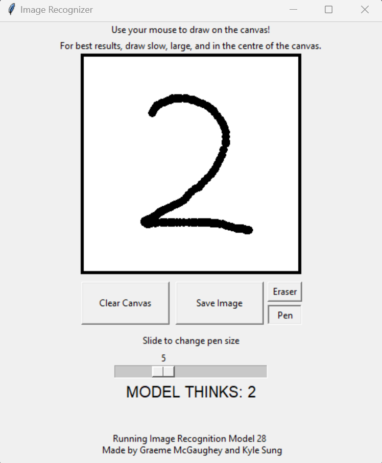

# Image Recognition: Digits



Welcome to the Image Recognition repository! This project focuses on developing a neural network that can identify handwritten digits from images, as well as a GUI built in to handwrite digits. The neural network is designed to process and classify images of digits (0-9) using machine learning techniques.

## Table of Contents

- [Image Recognition: Digits](#image-recognition-digits)
  - [Table of Contents](#table-of-contents)
  - [Installation and Usage](#installation-and-usage)
  - [Contributing](#contributing)


## Installation and Usage

To get started with the project, follow these steps:

1. Clone this repository to your local machine:
  ```bash
  git clone https://github.com/gmcga/image_recognizer.git
  ```

2. Install the required dependencies:
  ```bash
  pip install -r installation/requirements.txt
  ```

3. Run ``main.py``
  ```bash

    pip install -r requirements.txt
  ```


## Contributing

We welcome contributions to improve and expand this project. If you find any issues or have ideas for enhancements, feel free to create issues or pull requests in this repository.

License: no license currently; please credit us if you plan to use our code in your own project.


Explore, experiment, and learn. Happy coding!

Maintainers:
- Kyle Sung
- Graeme McGaughey
